# 画面の紹介

**やりたいことリスト100** は、やりたいことを 100 個書き溜めて、叶えたら印を付けていくアプリ。
ログインしなくても開いたその場で書けて、ログインすると複数のリストを持ったり、人に見せたりできる。

**https://yaritai100list.aiandrox.workers.dev**

以下は主な画面。

---

| 開いたらすぐ書ける | 「やった」印はログインしてから |
|:---|:---|
| 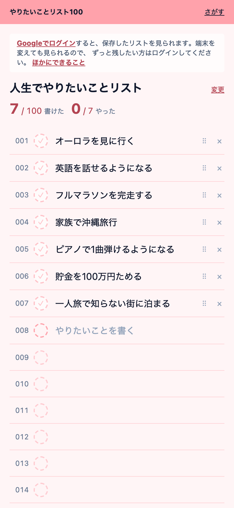 | 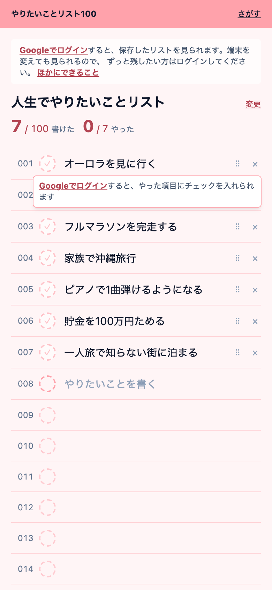 |
| アクセスするとすぐ 100 個の枠が並んだリストが出て、その場で書き始められる。ログインも初期設定も要らない。書いた内容はブラウザに残り、次に開いたときも戻っている。 | 叶えた印を付けるにはログインが要る。ログインせずに印を押すと、その行の上に「Google でログインすると、やった項目にチェックを入れられます」と出る。 |

| 叶えた記録が残る | 完了日は後から直せる |
|:---|:---|
| 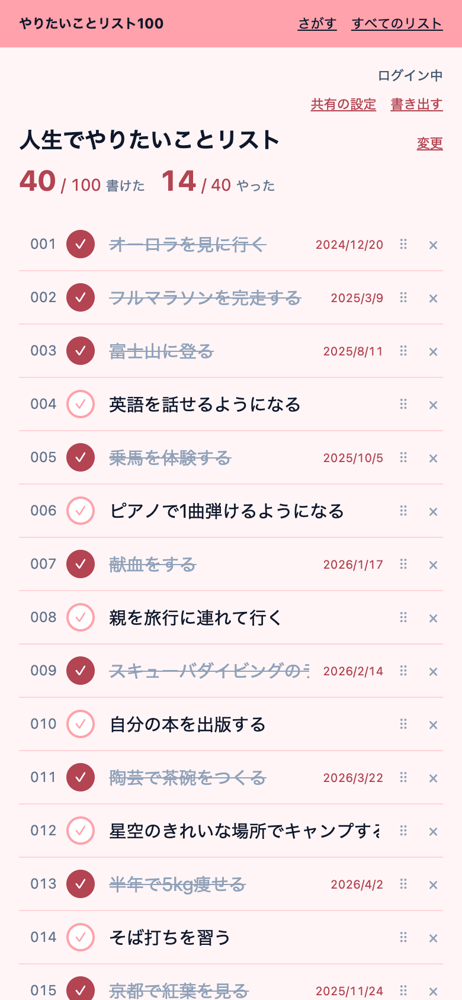 | 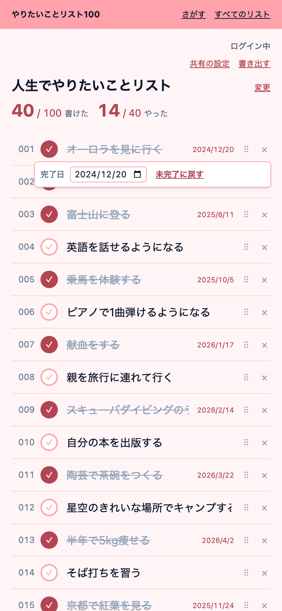 |
| ログインすると、最後に開いていたリストがそのまま表示される。叶えた項目には打ち消し線と達成日が付き、「14 / 40 やった」と進み具合が分かる。叶えても項目の順番は動かないので、どれを消したか見失わない。 | 叶えた項目の印をもう一度押しても、すぐには取り消されない。「完了日を直す」「未完了に戻す」が開く。うっかり一度押しただけで思い出が消えないようにしてある。 |

| いくつもリストを持てる | 見せる範囲を選べる |
|:---|:---|
| 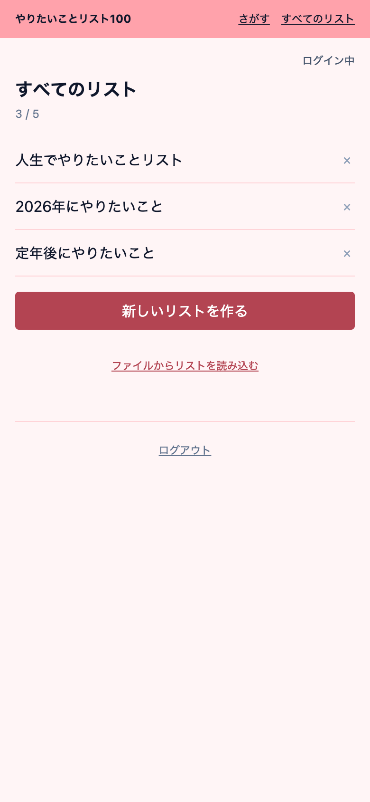 | 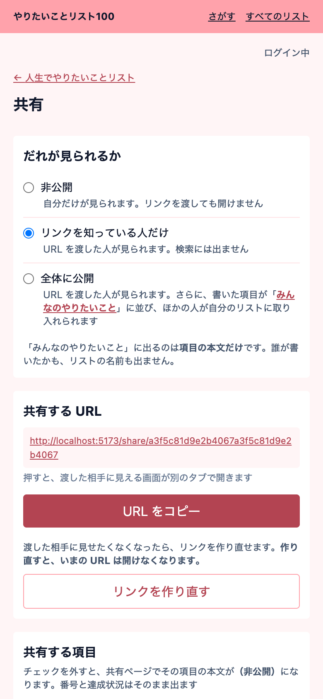 |
| 「人生でやりたいこと」「2026 年にやりたいこと」のように、目的で分けて最大 5 つのリストを持てる。作る・名前を変える・消す、手元のファイルから読み込む、といった操作ができる。 | 非公開 / リンクを知っている人だけ / 全体に公開 の 3 段階。共有リンクは作り直すと前のリンクが開けなくなる。リストごとだけでなく、項目 1 つずつ「共有ページでは本文を隠す」も選べる。 |

| 共有ページ | みんなのやりたいこと |
|:---|:---|
| 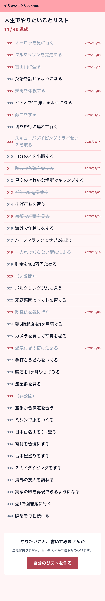 | 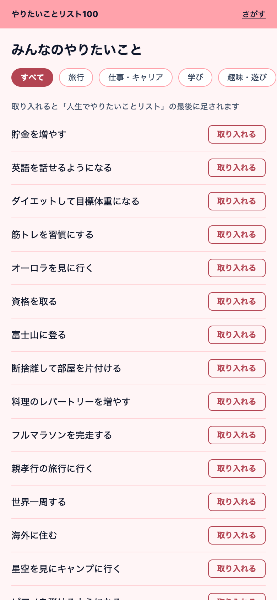 |
| 共有 URL を開くと、番号付きの一覧と達成状況が見える（書き込みはできない）。誰のリストかは出ない。本文を隠した項目は「（非公開）」と表示され、番号と達成数はそのまま残る。 | 全体に公開されたリストの項目が集まる場所。ジャンルで絞り込める。気に入った項目の「取り入れる」を押すと、自分のリストの最後に加わる。ここはログインしていなくても使える。 |

| 書き出す | ダウンロードできる画像 |
|:---|:---|
| 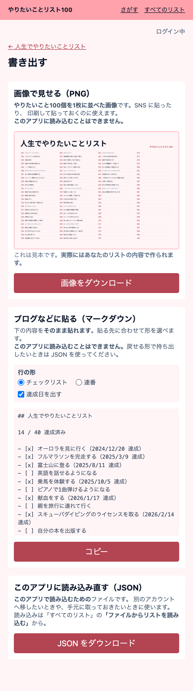 | 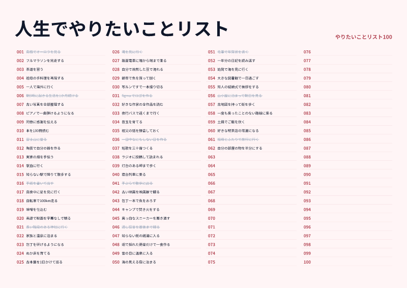 |
| SNS に貼れる画像、ブログに貼れるテキスト（チェックリスト形式か連番か、達成日を出すかを選べる）、あとで読み込み直せるファイルの 3 通りで持ち出せる。 | やりたいこと 100 個を 1 枚に並べた画像。まだ書いていない番号も枠だけ並ぶので「あと何個」が見える。叶えた項目には打ち消し線が入る。 |

### SNS に貼ったときのカード

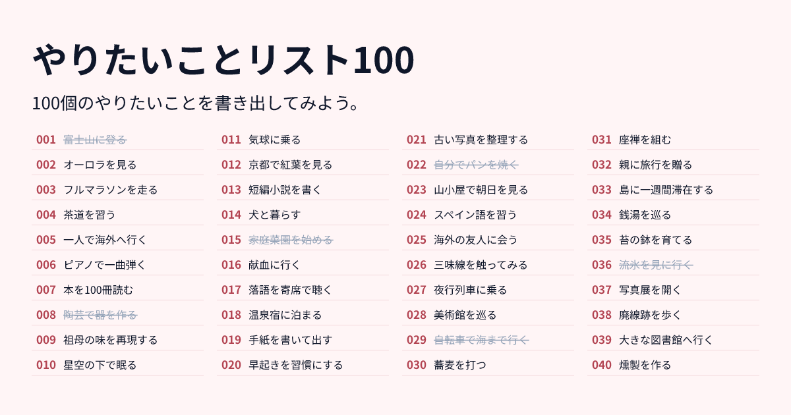

アプリのページを SNS に貼ると、番号付きの升目と打ち消し線が並んだカード画像が表示される。
個別の共有リンクを貼ったときは、そのリストのタイトルと達成状況（`23 / 100` など）が入ったカードになる。
